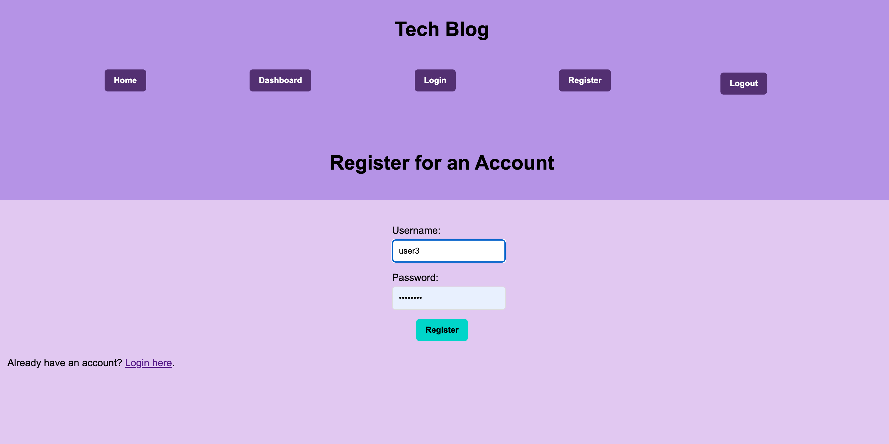
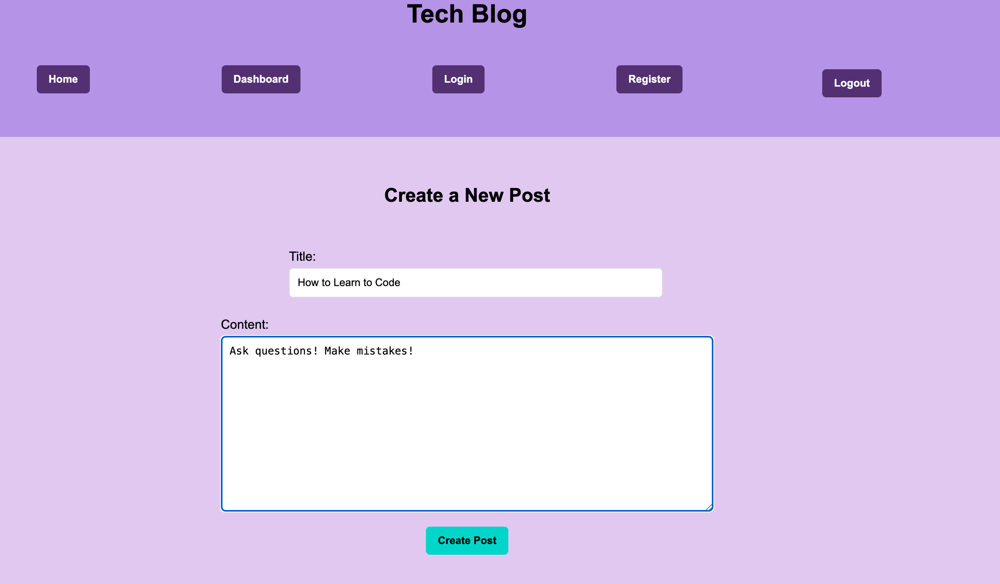

# Tech Blog
The Tech Blog will help users share what they've learned with each other.

## Description 

The aim of this project was to create a blog site, following the MVC paradigm. This application uses Handlebars.js, Sequelize, ORM, and express-session. Users can create an account, create new posts, update and delete existing posts. 

One of the goals of this project was to allow users to comment on posts. This feature will be implemented at a later time. 

This project was a great learning experience. Creating both the back-end and front-end, and then connecting them together was a huge challenge. I learned a lot about troubleshooting, resolving errors when routes didn't match up, keeping track of capitals and plurals within the variables, and importing/exporting modules. 

I also learned how to use add-ons with Heroku, such as JawsDB, which allows mysql and Sequelize to function correctly once deployed. 

## Usage 
[Vist the deployed Site](https://ajp-tech-blog-67472f936680.herokuapp.com/)

First Create an account. Choose a username and enter a password at least 8 characters long. Your information will be saved and you will be logged in automatically. 

Visit the Home page to see all of the available posts from Tech Blog users. 

Navigate to the Dashboard to view your own posts. 

 

Click New Post to reach the new post form. Enter a title and text content, then click Create Post to submit it. You will be automatically redirected to the Dashboard, where you can see all your posts. 

Each new post can be updated or deleted by clicking on the respective update and delete buttons. 

## Credits 

[Here](https://www.digitalocean.com/community/tutorials/how-to-use-sequelize-with-node-js-and-mysql) is one of the resources I used to learn more about Sequelize. 

I used [this guide](https://www.digitalocean.com/community/tutorials/understanding-relational-databases) to better understand relational databases. 

[This tutorial](https://www.w3schools.blog/spring-mvc-tutorial) helped me better understand the MVC structure. 

## License 

This project was created for edcucational purposes and does not have a license. 
